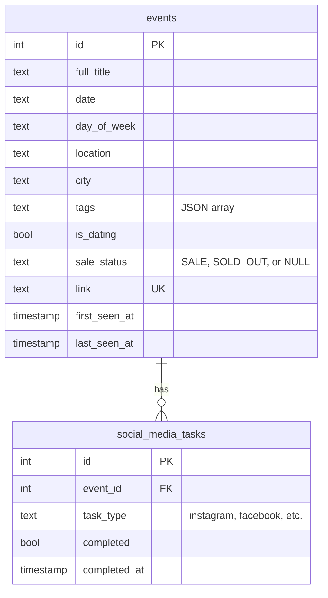

# STST Events Scraper & Dashboard

A Python application for scraping and managing event data from the [Skip the Small Talk](https://www.skipthesmalltalk.com) website. Features a Streamlit dashboard for visualization and task management.

## Features

- Web scraper using Selenium to extract event data
- SQLite database for persistent storage
- Streamlit dashboard with:
  - Upcoming events (filterable by location, tags, dating)
  - Newly added events
  - Sale status tracking (on sale / sold out)
  - Social media checklist per event
- Docker support for portable deployment

## Requirements

- Python 3.11+
- [Poetry](https://python-poetry.org/) for dependency management
- [Taskfile](https://taskfile.dev/installation/) for task running
- Chrome/Chromium (for Selenium)

## Quick Start

```bash
# Install dependencies
task install-poetry

# Scrape events from website
task refresh

# Launch dashboard (default task)
task dashboard
```

Access the dashboard at `http://localhost:8501`

## Commands

```bash
task dashboard      # Launch Streamlit dashboard
task refresh        # Scrape website and update database
task refresh-debug  # Scrape with browser visible (debugging)
task notebook       # Launch Jupyter notebook
task clean          # Remove cache files
task teardown       # Delete virtual environment
```

### Docker

```bash
task docker-build   # Build Docker image
task docker-run     # Run dashboard in Docker
task docker-refresh # Run scraper in Docker
```

## Database Schema



## Project Structure

```
stst_dev/
├── stst_dev/                    # Python package
│   ├── config.py                # Configuration constants
│   ├── models.py                # Data models (Event, SocialMediaTask)
│   ├── scraper.py               # Web scraper (Selenium)
│   └── database.py              # SQLite operations
├── dashboard/
│   └── app.py                   # Streamlit dashboard
├── scripts/
│   └── refresh_events.py        # CLI script to run scraper
├── data/
│   └── events.db                # SQLite database (gitignored)
├── Dockerfile
├── docker-compose.yml
├── pyproject.toml
└── Taskfile.yml
```

## License

MIT
