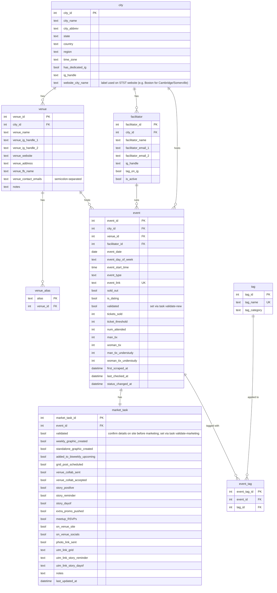

# STST Events Scraper & Dashboard

A local Python tool for scraping and managing event data from the [Skip the Small Talk](https://www.skipthesmalltalk.com) website. Tracks events, venues, facilitators, and social media marketing tasks in a local SQLite database, with a Streamlit dashboard for visualization and workflow management.

## Requirements

- Python 3.11+
- [Poetry](https://python-poetry.org/) for dependency management
- [Taskfile](https://taskfile.dev/installation/) for task running
- Chrome/Chromium (for Selenium)

## Quick Start

```bash
# Install dependencies
task install-poetry

# Initialize database (first time only)
task seed

# Scrape events from website
task refresh

# Launch dashboard
task dashboard
```

Access the dashboard at `http://localhost:8501`

## Commands

```bash
# Database
task seed              # Initialize database from schema.sql and seed_data.yaml (wipes existing data)
task seed-update       # Upsert cities/venues/facilitators/tags from seed_data.yaml (preserves event data)

# Scraper
task refresh           # Scrape website and update database
task refresh-debug     # Scrape with browser visible (debugging)

# Validation
task validate-new      # Review and validate newly scraped events (sets event.validated)
task validate-marketing  # Confirm event details on site before marketing tasks (sets market_task.validated)

# Dashboard
task dashboard         # Launch Streamlit dashboard (default task)

# Dev
task db                # Open SQLite database in interactive shell
task notebook          # Launch Jupyter notebook
task clean             # Remove Python cache files
task teardown          # Delete virtual environment
```

### Docker

```bash
task docker-build   # Build Docker image
task docker-run     # Run dashboard in Docker
task docker-refresh # Run scraper in Docker
task docker-down    # Stop Docker containers
```

## Architecture

The system has three layers:

1. **`scraper.py`** — scrapes the STST website, upserts event records into SQLite, detects new events and sold-out status changes, auto-creates `market_task` rows for new events
2. **`output.py`** *(planned)* — queries the database and generates plain-text Canva lines and social media post content
3. **`dashboard/app.py`** *(in progress)* — local Streamlit dashboard for viewing events, tracking marketing task completion, and surfacing promotion priorities

## Project Structure

```
stst_dev/
├── stst_dev/                    # Python package
│   ├── __init__.py
│   ├── scraper.py               # Web scraper (Selenium)
│   ├── database.py              # SQLite operations
│   ├── models.py                # Data models
│   └── config.py                # Configuration constants
├── dashboard/
│   └── app.py                   # Streamlit dashboard
├── scripts/
│   ├── refresh_events.py        # CLI: run scraper
│   ├── seed_db.py               # CLI: initialize database from scratch
│   ├── seed_update.py           # CLI: upsert lookup table data without wiping events
│   ├── validate_new.py          # CLI: review and validate newly scraped events
│   └── validate_marketing.py    # CLI: confirm event details before marketing tasks
├── data/
│   ├── seed_data.yaml           # Manually maintained: cities, venues, facilitators, tags
│   └── events.db                # SQLite database (gitignored)
├── schema.sql                   # v2 database DDL
├── STST_DBv2_plan.md            # Architecture and build plan
├── Dockerfile
├── docker-compose.yml
├── pyproject.toml
└── Taskfile.yml
```

## Database Schema

Seven tables. Lookup tables (`city`, `venue`, `facilitator`, `tag`) are seeded from `seed_data.yaml`. Event data is populated by the scraper.



### City/Website Name Mapping

The STST website uses broader city labels that don't always match actual city names. `city.website_city_name` stores the label used on the website when it differs from `city.city_name`. The scraper resolves city via venue lookup first (`venue_alias` → `venue` → `city`), using `website_city_name` as a fallback.

| city_name | website_city_name |
|---|---|
| Cambridge | Boston |
| Somerville | Boston |
| New Haven | Connecticut |
| New London | Connecticut |

## Seed Data

`data/seed_data.yaml` is the source of truth for manually maintained lookup data. Edit it to add cities, venues, facilitators, or tags, then run:

```bash
task seed-update   # Safe to run against a live database — preserves all event data
task seed          # Full rebuild — wipes and recreates everything (use for schema changes)
```

## Google Sheets / Ticket Sync (planned)

A `ticket_sync.py` script will sync ticket sales and attendance data from the team's Google Sheet into the `event` table (`tickets_sold`, `ticket_threshold`, `num_attended`). See `STST_DBv2_plan.md` for details.

### Future: Publish to Google Sheets

A `task publish` command could export a read-only view of the database to a shared Google Sheet for broader team access, with tabs such as:

- **Upcoming Events** — validated upcoming events with date, city, venue, facilitator, type, tags, link, and sold-out status
- **Marketing Tasks** — a working copy of upcoming events with the full marketing task checklist as columns (filled in independently of the DB)
- **Newsletter Updates** — events grouped by region or recently added, for drafting newsletter content

This would use a service account for authentication (credentials gitignored) and could be triggered manually or automatically after `task refresh`.

## Build Status

Per `STST_DBv2_plan.md`:

- [x] Define schema and write DDL
- [x] Seed lookup tables (city, venue, facilitator, tag)
- [ ] Build and test scraper v2 (UTM link generation, market_task auto-creation)
- [ ] Build and test ticket_sync.py
- [ ] Build and test output.py
- [ ] Streamlit dashboard v2

## Security

This repository is intended for public release. See `CLAUDE.md` for full security guidelines. Never commit:
- API keys, tokens, or credentials
- `.env` files
- `data/*.db` files (already gitignored)

## License

MIT
